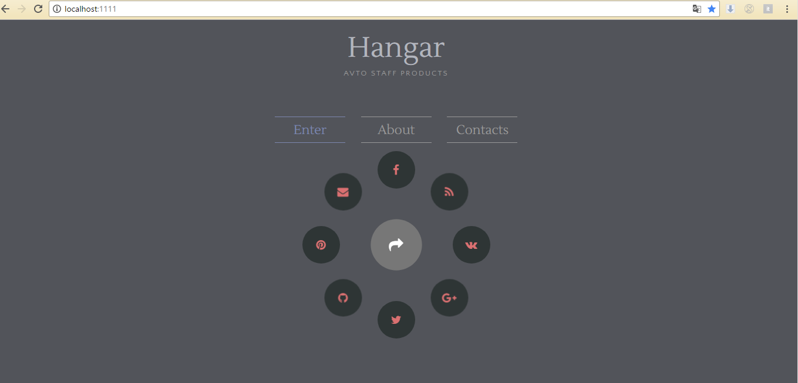
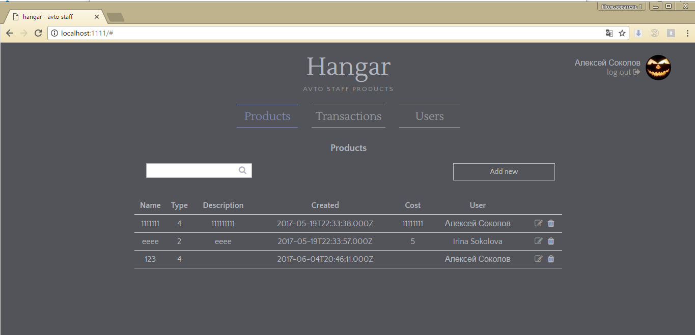
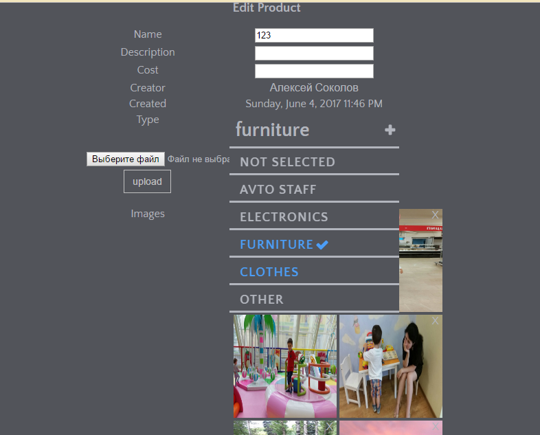
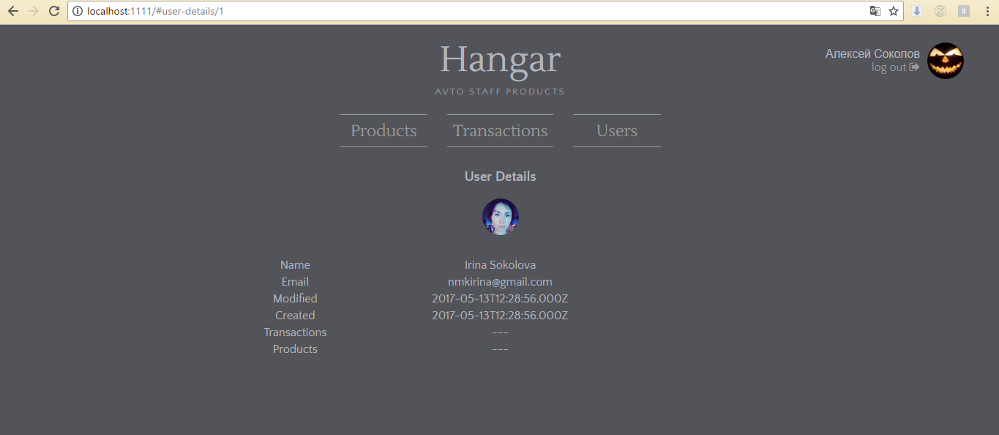

# hangar

simple riot.js application

# build

install dependencies
```javascript
npm i
```

install gulp globaly
```javascript
npm i -g gulp
```

build project + start server
```javascript
gulp
```








